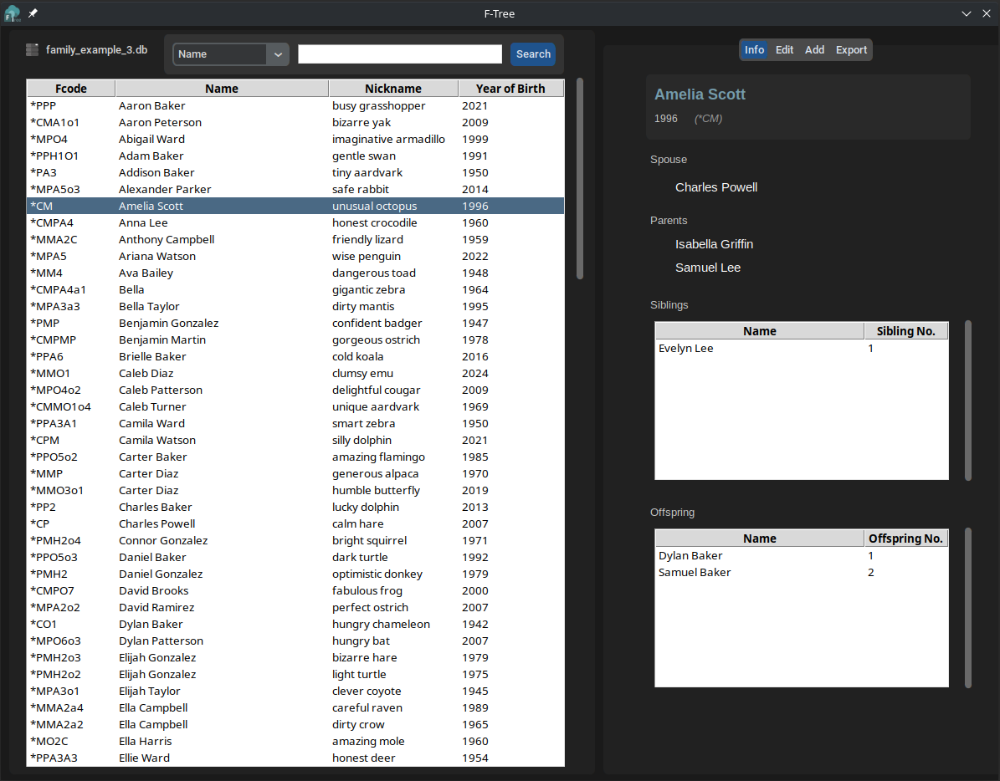
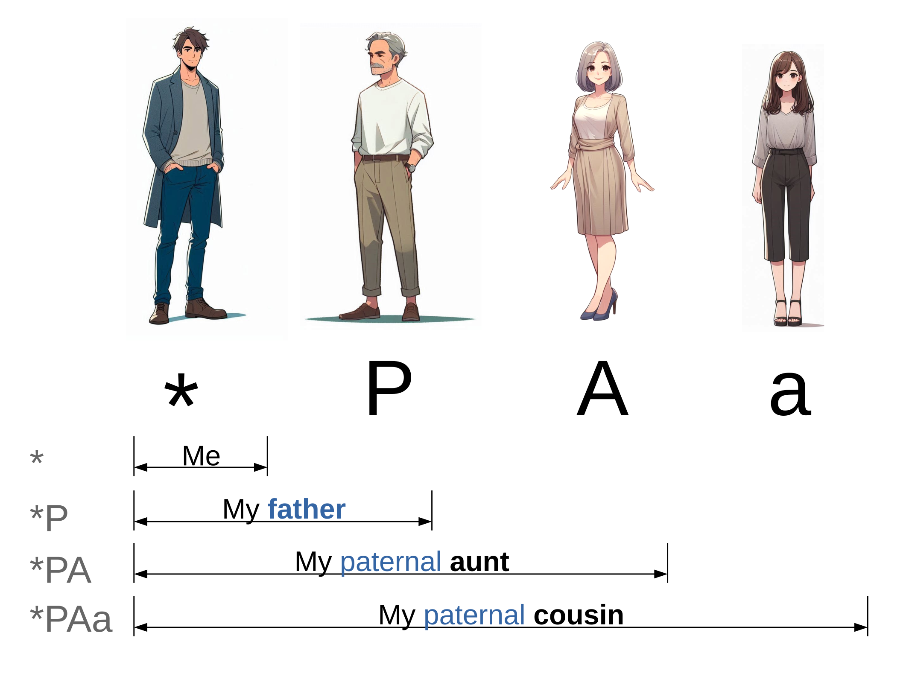

#  F-Tree


F-Tree is a graphical user interface (GUI) for managing and visualizing genealogical data using the Fcode method, a system for encoding kinship relations described by Pérez-Rodríguez et al.. With F-Tree, you can easily create, edit, import, and expand family trees, allowing you to explore and understand your family connections in an efficient and user-friendly way.



## What are Fcodes?

The Fcode method is a system for encoding kinship relationships using a simple, human-readable code. Each Fcode is a string of characters representing a specific family relationship, where the first character is always an asterisk (*) symbolizing the "origin of coordinates." The subsequent characters describe the relationship between the origin and another individual within the family network.



For example, if we take Bart as the origin of coordinates (\*):
- \* represents Bart.
- *M3 represents the mother of Bart (third among her siblings).
- *P2 represents the father of Bart (second among his siblings).
- *PP1 represents the father of the father of Bart (older among his siblings).
- *A2 represents the sister of Bart (second among her siblings).
- *o1 represents the son of Bart (first among his offspring).

You can refer to a complete description of Fcodes [here](https://github.com/Dannyzimmer/fcodes).

# What does F-Tree do?

F-Tree is specifically designed to facilitate working with Fcodes. Here are some of the benefits of using F-Tree and the Fcode method:

- **Efficiency and Human Readability**: The Fcode algorithm uses a simple encoding legend that is both efficient to implement and easy for humans to understand. This is because kinship relationships are deduced from a set of codes, eliminating the need for a rigid structure. Fcodes are also adaptable because they operate independently; they can be inserted "out of sequence".

- **Flexibility in Encoding**: F-Tree provides a variety of ways to visualize and analyze genealogical data. You can conduct searches within the database to find specific individuals and their relationships. The results can be used to generate family tree diagrams in PDF format, as well as detailed reports that outline individuals and their connections to others in the database, all conveniently available in PDF format.

- **Multiple Visualization Options**: F-Tree offers different ways to visualize and navigate through genealogical data. You can generate family tree diagrams in PDF format, as well as create comprehensive reports that detail individuals and their relationships to others in the database, also available in PDF format.

- **Preserve your family history**: F-Tree enables you to store detailed individual information for each family member in the database, including names, nicknames, birth dates, and biographies. As an open-source software solution, F-Tree ensures that both **the encoding algorithm and the data formats are transparent and accessible**, empowering you to maintain your family's legacy with confidence and flexibility.

# Installation

## From release
To install F-Tree, follow these simple steps:

1. **Download the Software**: Download the latest release of F-Tree corresponding to your operating system from this GitHub repository. The software is distributed as a compressed ZIP file.
    - Download for Linux.
    - Download for Windows. 

2. **Extract the ZIP File**: Once the download is complete, locate the ZIP file and extract its contents to a directory of your choice. This will create a single directory containing all the necessary files for F-Tree to function.

3. **Run the Application**: Navigate to the extracted directory and locate the executable file `F-Tree`. Double-click on it to launch the application.

For users who prefer to set up F-Tree in a more controlled environment, the next section will cover how to install it by creating a Conda environment, a venv, or using a Docker image.

If you encounter any issues during installation, feel free to open an issue on this repository.

## Creating a development environment

### Conda environment

```sh
conda create -n fcodes_gui python=3.10
conda activate fcodes_gui
conda install pango
python3 -m pip install -r requirements.txt
```

### Virtual environment

```sh
apt install -y pango1.0-tools tk
python3 -m .venv venv
./venv/bin/activate
python3 -m pip install -r requirements.txt
```

## Using a Docker image

### Building

```sh
docker build ./ -t fcodes_gui
```

### Running

Replace `$(pwd)` by the path to the host directory you want to have available inside the Docker image:

```sh
xhost + && docker run --rm -ti -e USERID=$UID -e USER=$USER -e DISPLAY=$DISPLAY -v /var/db:/var/db:Z -v /tmp/.X11-unix:/tmp/.X11-unix -v $HOME/.Xauthority:/home/developer/.Xauthority -v "$(pwd):/data" -w /data fcodes_gui
```